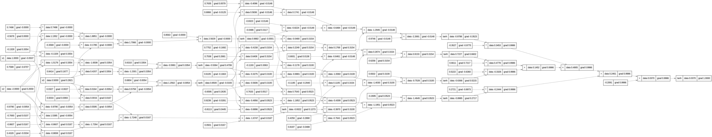

# Autodiff engine in C++

Ce projet est une **implémentation C++ d’un moteur d’auto-différentiation** inspiré de [Micrograd](https://github.com/karpathy/micrograd) de Andrej Karpathy.  
Il permet de construire des **graphes computationnels dynamiques**, de calculer automatiquement les **gradients** via rétropropagation, et d’implémenter des **réseaux de neurones simples (MLP)**.
 
### Travaux en cours !! 
Le projet est actuellement en cours d'extension : 
le cœur du moteur (autodiff et rétropropagation) et la structure du réseau de neurones (MLP) sont fonctionnels. La prochaine étape majeure est l'implémentation de la boucle d'apprentissage (training loop) sur un problème réel.

Un **fichier training.cpp** sera ajouté prochainement pour mettre en œuvre la descente de gradient stochastique (SGD), enchaînant la passe avant, le calcul de la fonction de perte, la rétropropagation et la mise à jour des paramètres du modèle.

### engine.cpp/engine.h
Ce fichier implémente le cœur du moteur de calcul différentiable du projet.  
Il définit la classe `Value`, qui encapsule une valeur scalaire, son gradient, ainsi que le graphe computationnel nécessaire à la rétropropagation automatique.
`engine.cpp` gère :

- La **création du graphe de calcul** via la surcharge des opérateurs mathématiques .
- Le **suivi des dépendances** entre les opérations grâce à des pointeurs vers les nœuds précédents.
- L’**exécution de la rétropropagation** avec la méthode `backward()`, qui calcule les gradients pour chaque nœud du graphe selon l’ordre topologique.
Opérations supportées :Soustraction, Multiplication, Division, Puissance, Négation, ReLU, Tanh. 

### test.cpp
Ce fichier contient plusieurs **tests unitaires** qui valident le bon fonctionnement du moteur d’autograd.

- test_sanity_check() : Sert de **test de cohérence basique** du moteur ,il met en place un petit graphe avec plusieurs opérations imbriquées.
- test_more_ops() : teste la stabilité du moteur sur des calculs plus complexes.

Rq : Les valeurs sont comparées avec une tolérance numérique (1e-6 ou 1e-4) pour gérer les erreurs de flottants.

### nn.cpp/nn.h
Ce fichier introduit les classes `Neuron`, `Layer` et `MLP`, qui permettent de composer des opérations différentiables pour l’apprentissage automatique.
l'objectif étant de fournir une abstraction de haut niveau pour construire et entraîner de petits modèles de réseau de neurones :
- Chaque **neurone** combine des entrées pondérées, applique un biais et une fonction d’activation.
- Les **couches** empilent plusieurs neurones.
- Le **MLP** combine plusieurs couches séquentiellement.
Rq :
-Les poids sont initialisés aléatoirement à l’aide de rand_double().
-La fonction d’activation utilisée est tanh, mais peut etre remplacée par ReLU ou sigmoid.
-Les paramètres retournés par parameters() peuvent être optimisés via une boucle d’apprentissage (descente de gradient).

### testneuron.cpp
Ce fichier sert de **démonstration pratique** du moteur d’autodiff et du MLP minimaliste.  
Il montre comment construire un neurone, effectuer un calcul forward, calculer les gradients via `backward()`, et générer un graphe de calcul Graphviz.
Rq: le test ne fait qu’exécuter un seul neurone isolé, il ne profite pas encore du MLP ni des couches multiples.

### graph.cpp/graph.h

Ce fichier permet de **générer automatiquement une représentation visuelle du graphe de calcul** construit par le moteur d’auto-différentiation.  
Il transforme les dépendances entre objets `Value` en un graphe au format **Graphviz (.dot)**.

## testMLP.cpp
Ce fichier est la démonstration de référence du réseau de neurones complet. Il illustre l'intégration réussie de l'autodiff avec la structure du MLP. Il instancie un MLP, effectue une passe avant, exécute la rétropropagation sur la sortie, et affiche les gradients de tous les paramètres du modèle. Crucialement, il génère le graphe computationnel complet de cette exécution pour une vérification visuelle de la chaîne de dépendances.

